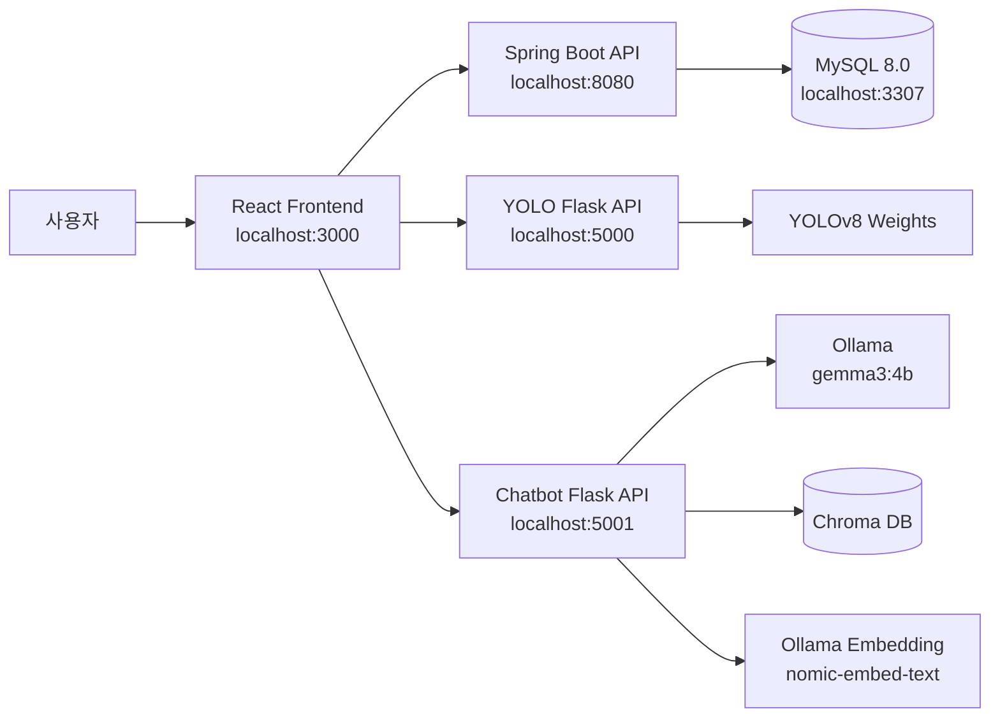

# Triple Skin

> AI 피부 이미지 분석, 피부 유형 설문, 피부 관리 기록과 커뮤니티를 하나로 연결한 피부 관리 플랫폼

Triple Skin은 사용자가 피부 사진과 생활 기록을 바탕으로 자신의 피부 상태를 꾸준히 관리할 수 있도록 만든 팀 프로젝트입니다. YOLOv8 이미지 분석과 RAG 기반 피부 상담 챗봇을 각각 독립된 Flask 서비스로 구성하고, Spring Boot API와 React 화면에서 통합했습니다.

## 프로젝트 소개

피부 고민은 한 번의 진단보다 지속적인 관찰과 관리가 중요합니다. Triple Skin은 다음 과정을 하나의 웹 서비스에서 제공하는 것을 목표로 합니다.

1. 피부 사진을 업로드하고 AI 분석 결과 확인
2. 피부 유형 설문으로 개인 피부 특성 파악
3. 분석 기록과 일정을 캘린더에서 관리
4. 사용자 커뮤니티에서 경험과 정보 공유
5. 피부 연구 자료 기반 챗봇으로 관리 방법 탐색

## 주요 기능

### AI 피부 이미지 분석

- YOLOv8 모델을 이용한 피부 이미지 추론
- 여드름(`acne`), 아토피(`ato`), 색소침착·잡티(`bi`), 정상(`normal`) 영역 탐지
- 탐지 영역 시각화 이미지와 유형별 개수 제공
- 분석 결과 저장, 최신 결과 및 날짜별 이력 조회

### RAG 피부 상담 챗봇

- Ollama `gemma3:4b` 기반 한국어 답변 생성
- `nomic-embed-text`와 Chroma DB를 이용한 피부 연구 자료 검색
- 검색 자료와 일반적인 피부 관리 원칙을 구분해 안내
- 사용자 세션별 대화 문맥 유지 및 새 대화 기능
- 피부 성분 영문명을 한국어 표기와 함께 제공

### 피부 유형 설문과 기록

- 피부 유형 질문 기반 결과 분석
- 최근 결과, 오늘 결과 및 전체 이력 관리
- 피부 관리 일정과 할 일을 캘린더로 관리
- 분석 결과에 대한 사용자 피드백 등록

### 사용자 및 커뮤니티

- 회원가입, 로그인, 회원정보 및 프로필 이미지 관리
- 게시글 작성·수정·삭제와 댓글 기능
- 좋아요, 스크랩, 신고 및 관리자 처리 기능
- 사용자 활동 알림과 읽지 않은 알림 수 제공
- 내가 작성한 글·댓글, 좋아요·스크랩 게시글 조회

## 시스템 구성



YOLO 추론 서버와 챗봇 서버를 분리하여 모델별 의존성과 장애 범위를 독립적으로 관리할 수 있도록 구성했습니다.

## 기술 스택

| 영역 | 기술 |
| --- | --- |
| Frontend | React 19, React Router, Axios, Recharts, CSS |
| Backend | Java 17, Spring Boot, Spring Data JPA, Gradle |
| Database | MySQL 8.0, Docker Compose |
| Vision AI | Flask, Ultralytics YOLOv8, OpenCV, NumPy |
| Chatbot AI | Flask, LangChain, Chroma, Ollama, Gemma 3 |
| Embedding | `nomic-embed-text` |

## 디렉터리 구조

```text
Last_project/
├─ frontend/          # React 사용자 화면
├─ backend/           # Spring Boot REST API
├─ flask/             # YOLOv8 피부 이미지 추론 서버
├─ chatbot-flask/     # RAG 피부 상담 챗봇 서버
├─ sql/               # Docker MySQL 초기화 SQL
├─ database/          # 데이터베이스 관련 자료
├─ docker-compose.yml
└─ start-dev-tabs.bat # Windows 개발 서버 실행 도우미
```

## 실행 전 준비

### 요구 사항

- Java 17
- Node.js 및 npm
- Python 또는 Conda
- Docker Desktop
- Ollama

이 프로젝트의 개발 환경에서는 Conda의 `pknu_skin` 환경으로 두 Flask 서버를 실행합니다.

### 환경 변수

루트의 `.env.example`을 `.env`로 복사하고 로컬 비밀번호를 설정합니다.

```powershell
Copy-Item .env.example .env
```

Spring Boot 실행 환경에도 같은 DB 값을 설정합니다.

```powershell
$env:DB_HOST="localhost"
$env:DB_PORT="3307"
$env:DB_NAME="skin_db"
$env:DB_USERNAME="skin"
$env:DB_PASSWORD="your_password"
```

`.env` 파일과 실제 비밀번호는 Git에 포함하지 않습니다.

또는 로컬 개발에서는 다음 예시 파일을 복사해 사용할 수 있습니다.

```powershell
Copy-Item backend/src/main/resources/application-dev.properties.example backend/src/main/resources/application-dev.properties
```

`application-dev.properties`에 로컬 MySQL 계정 정보를 입력합니다. 이 파일은 Git에서 제외됩니다.

## 설치 및 실행

### 1. MySQL

```powershell
docker compose up -d
```

MySQL은 호스트의 `3307`번 포트로 실행되며 `sql/init.sql`을 이용해 초기화됩니다.

### 2. Spring Boot API

```powershell
cd backend
.\gradlew.bat bootRun
```

### 3. React Frontend

```powershell
cd frontend
npm install
npm start
```

개발 프록시는 `/spring`, `/flask`, `/chatbot` 요청을 각각의 로컬 API 서버로 전달합니다.

### 4. YOLO Flask 서버

```powershell
conda activate pknu_skin
cd flask
pip install -r requirements.txt
python app.py
```

기본 포트는 `5000`입니다. 추론 가중치는 `flask/models/skin_bi_ato_acne_normal_v3/weights/best.pt`에 포함되어 있습니다.

### 5. 챗봇 Flask 서버

먼저 Ollama 모델을 준비합니다.

```powershell
ollama pull gemma3:4b
ollama pull nomic-embed-text
```

노트북에서 생성한 다음 로컬 자산은 용량 문제로 Git에 포함하지 않습니다.

```text
chatbot-flask/data/
├─ Chroma_DB_Skin_v6/
└─ ingredient_dictionary_100.xlsx
```

그다음 서버를 실행합니다.

```powershell
conda activate pknu_skin
cd chatbot-flask
pip install -r requirements.txt
python app.py
```

기본 포트는 `5001`입니다. 자세한 설정은 `chatbot-flask/.env.example`과 `chatbot-flask/README.md`에서 확인할 수 있습니다.

### Windows 통합 실행

필수 의존성과 데이터 준비가 끝났다면 루트에서 다음 파일을 실행할 수 있습니다.

```powershell
.\start-dev-tabs.bat
```

## 주요 API

| 서비스 | 메서드 | 경로 | 설명 |
| --- | --- | --- | --- |
| YOLO Flask | `POST` | `/predict` | 피부 이미지 분석 |
| Chatbot Flask | `POST` | `/chat` | RAG 챗봇 질문 |
| Chatbot Flask | `DELETE` | `/sessions/{sessionId}` | 대화 초기화 |
| Spring Boot | `POST` | `/deep/save` | AI 분석 결과 저장 |
| Spring Boot | `GET` | `/deep/history` | 분석 이력 조회 |
| Spring Boot | `POST` | `/skin-type/results` | 피부 유형 결과 저장 |
| Spring Boot | `GET/POST` | `/community/posts` | 커뮤니티 게시글 조회·등록 |
| Spring Boot | `GET/POST` | `/calendar` | 피부 관리 일정 조회·등록 |

## 모델 및 데이터 관리

- YOLO 가중치는 저장소에 포함되어 바로 추론할 수 있습니다.
- Chroma DB는 약 928MB이므로 `.gitignore`로 제외합니다.
- 사용자 업로드 이미지는 개인정보가 포함될 수 있어 저장소에 포함하지 않습니다.
- DB 비밀번호와 환경별 설정은 `.env` 또는 시스템 환경변수로 관리합니다.

## 개선 과제

- 사용자 인증 토큰 및 비밀번호 암호화 강화
- 챗봇 세션 저장소를 메모리에서 Redis 등 외부 저장소로 전환
- AI 모델 서버의 비동기 처리와 요청 큐 적용
- 테스트 자동화 및 CI/CD 파이프라인 구축
- 모델 성능 지표와 서비스 화면 예시 추가

## 주의사항

AI 분석과 챗봇 답변은 의료 진단이나 처방을 대신하지 않습니다. 증상이 심하거나 지속되는 경우 피부과 전문의의 진료가 필요합니다.
