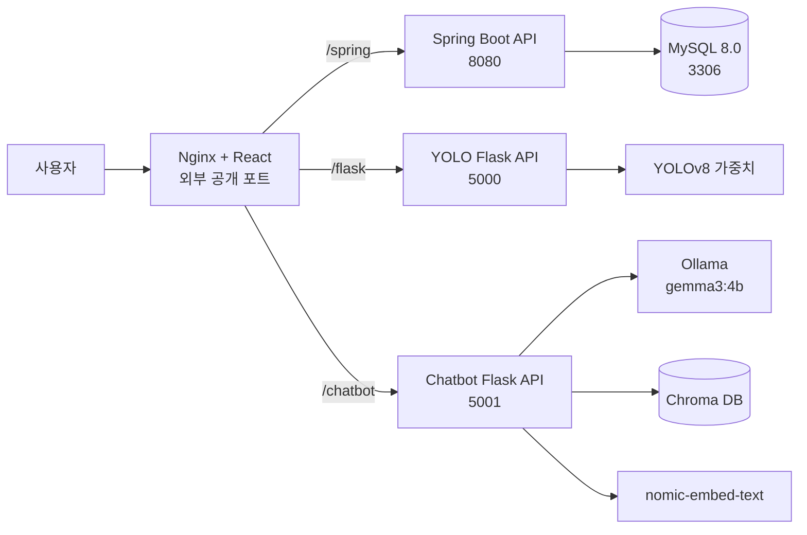

# Triple Skin

> AI 피부 이미지 분석, 피부 유형 설문, 피부 관리 기록과 커뮤니티를 하나로 연결한 피부 관리 플랫폼

Triple Skin은 사용자가 피부 사진과 생활 기록을 바탕으로 자신의 피부 상태를 꾸준히 관리할 수 있도록 만든 팀 프로젝트입니다. YOLOv8 기반 피부 이미지 분석, 피부 연구 자료를 활용한 RAG 챗봇, Spring Boot API와 React 웹 화면을 하나의 서비스로 통합했습니다.

## 프로젝트 개요

피부 고민은 한 번의 진단보다 지속적인 관찰과 관리가 중요합니다. Triple Skin은 다음 과정을 하나의 웹 서비스에서 제공합니다.

1. 피부 사진을 업로드하고 AI 분석 결과 확인
2. 피부 유형 설문을 통한 개인 피부 특성 파악
3. 분석 이력과 피부 관리 일정을 캘린더에서 관리
4. 커뮤니티에서 피부 관리 경험과 정보 공유
5. 피부 관련 연구 자료를 기반으로 한 챗봇 상담

## 주요 기능

### AI 피부 이미지 분석

- YOLOv8 모델을 이용한 피부 이미지 추론
- 여드름(`acne`), 아토피(`ato`), 색소침착·잡티(`bi`) 영역 탐지
- 탐지 영역이 표시된 분석 이미지와 유형별 탐지 개수 제공
- 분석 결과 저장과 오늘·최신·날짜별 이력 조회

### RAG 피부 상담 챗봇

- Ollama `gemma3:4b` 기반 한국어 답변 생성
- `nomic-embed-text`와 Chroma DB를 이용한 관련 자료 검색
- 피부 연구 자료와 화장품 성분 사전을 활용한 답변
- 사용자 세션별 대화 문맥 유지와 대화 초기화

### 피부 유형 설문과 관리 기록

- 피부 유형 질문 기반 결과 분석
- 오늘 결과, 최근 결과와 전체 이력 관리
- 피부 관리 일정과 할 일을 캘린더로 관리
- AI 분석 결과에 대한 사용자 피드백 등록

### 회원 및 커뮤니티

- 회원가입, 로그인, 회원정보와 프로필 이미지 관리
- 게시글 작성·수정·삭제와 댓글 기능
- 좋아요, 스크랩, 신고와 관리자 처리 기능
- 사용자 활동 알림과 읽지 않은 알림 수 제공
- 내가 작성한 글·댓글과 좋아요·스크랩 게시글 조회

## 시스템 구성



Nginx가 단일 진입점 역할을 하며 Spring Boot, YOLO Flask, 챗봇 Flask 서비스로 요청을 전달합니다. 각 AI 서버는 모델별 의존성과 장애 범위를 분리하기 위해 독립 컨테이너로 구성했습니다.

## 기술 스택

| 영역 | 기술 |
| --- | --- |
| Frontend | React 19, React Router, Axios, Recharts, Nginx |
| Backend | Java 17, Spring Boot 4.1, Spring Data JPA, Spring Security, Gradle |
| Database | MySQL 8.0 |
| Vision AI | Flask, Ultralytics YOLOv8, OpenCV, NumPy |
| Chatbot AI | Flask, LangChain, Chroma, Ollama, Gemma 3 |
| Embedding | `nomic-embed-text` |
| Infrastructure | Docker, Docker Compose |

## 최종 디렉터리 구조

```text
Last_project/
├─ 01_산출물/                         # 프로젝트 문서와 최종 산출물
│  ├─ 01_요구사항정의서_Triple_Skin.xlsx
│  ├─ 02_메뉴구조도_TripleSkin.xlsx
│  ├─ 04_테이블정의서_Triple_Skin.xlsx
│  ├─ 05_ERD_TripleSkin.pdf
│  ├─ 06_스크립트_명세서_Triple_Skin.docx
│  ├─ Triple_Skin_설치_매뉴얼_Local_AWS.txt
│  └─ 프로젝트_수행계획서_3조.docx
├─ 02_Source(모델링)/                 # AI 학습·전처리 자료
│  ├─ YOLOv8/
│  │  ├─ custom_dataset/              # 학습·검증 이미지와 라벨
│  │  ├─ data.yaml
│  │  └─ train_custom.py
│  └─ 챗봇/
│     ├─ Chroma_DB_Skin_v6/
│     ├─ 논문_분류/
│     ├─ ingredient_dictionary_100.xlsx
│     └─ skin_type_chatbot.ipynb
├─ 03_Source(서비스)/                 # 실제 웹 서비스 소스
│  ├─ backend/                        # Spring Boot REST API
│  ├─ frontend/                       # React UI와 Nginx 설정
│  ├─ flask/                          # YOLOv8 추론 API
│  ├─ chatbot-flask/                  # RAG 챗봇 API
│  ├─ database/                       # 데이터베이스 참고 자료
│  ├─ sql/                            # 초기화·마이그레이션 SQL
│  ├─ .env.example                    # 환경 변수 예시
│  └─ docker-compose.yml              # 전체 서비스 실행 구성
├─ .gitignore
└─ README.md
```

`01_산출물`과 `02_Source(모델링)`은 대용량 파일과 제출 자료를 포함하므로 루트 `.gitignore`에서 제외합니다. Git 저장소에는 서비스 소스인 `03_Source(서비스)`와 이 README를 중심으로 관리합니다.

## 서비스 구성

| 서비스 | 역할 | 컨테이너 포트 |
| --- | --- | ---: |
| `frontend` | React 정적 파일 제공과 API 리버스 프록시 | 80 |
| `spring` | 회원, 커뮤니티, 캘린더, 분석 이력 API | 8080 |
| `yolo-flask` | 피부 이미지 분석 | 5000 |
| `chatbot-flask` | RAG 피부 상담 챗봇 | 5001 |
| `ollama` | LLM과 임베딩 모델 실행 | 11434 |
| `mysql` | 서비스 데이터 저장 | 3306 |

기본 설정에서는 프런트엔드만 호스트의 `80`번 포트에 공개됩니다. MySQL은 로컬 확인을 위해 `127.0.0.1:3307`에 바인딩되며, 나머지 서비스는 Docker 내부 네트워크에서 통신합니다.

## 실행 방법

### 요구 사항

- Docker Desktop
- Docker Compose
- NVIDIA GPU와 Docker GPU 실행 환경
- 최초 모델 다운로드와 이미지 빌드를 위한 인터넷 연결

현재 `docker-compose.yml`의 Ollama 서비스는 NVIDIA GPU 1개를 요청하도록 설정되어 있습니다.

### 실행 전 확인

두 Flask Dockerfile은 각각 다음 의존성 파일을 사용합니다.

```text
03_Source(서비스)/flask/requirements.txt
03_Source(서비스)/chatbot-flask/requirements.txt
```

두 파일이 없으면 Docker 이미지 빌드가 실패하므로 최종 실행 또는 배포 전에 반드시 포함해야 합니다.

### 1. 서비스 폴더로 이동

```powershell
cd "03_Source(서비스)"
```

### 2. 환경 변수 파일 생성

```powershell
Copy-Item .env.example .env
```

`.env`에서 다음 비밀번호를 서로 다른 안전한 값으로 변경합니다.

```dotenv
MYSQL_ROOT_PASSWORD=replace_with_a_long_random_password
MYSQL_PASSWORD=replace_with_a_different_long_random_password
```

실제 `.env` 파일과 비밀번호는 Git에 커밋하지 않습니다.

### 3. 전체 서비스 실행

```powershell
docker compose up -d --build
```

최초 실행 시 Ollama가 `gemma3:4b`와 `nomic-embed-text`를 내려받기 때문에 시간이 걸릴 수 있습니다.

### 4. 실행 상태 확인

```powershell
docker compose ps
docker compose logs -f
```

모든 서비스가 정상적으로 실행되면 웹 브라우저에서 다음 주소로 접속합니다.

```text
http://localhost
```

`.env`의 `APP_PORT`를 변경했다면 `http://localhost:{APP_PORT}`로 접속합니다.

### 5. 서비스 종료

```powershell
docker compose down
```

데이터베이스, 업로드 이미지와 Ollama 모델은 Docker 볼륨에 유지됩니다. 볼륨까지 삭제하면 데이터가 함께 제거되므로 주의해야 합니다.

## 주요 환경 변수

| 변수 | 기본값 | 설명 |
| --- | --- | --- |
| `MYSQL_DATABASE` | `skin_db` | MySQL 데이터베이스 이름 |
| `MYSQL_USER` | `skin` | 애플리케이션 DB 계정 |
| `MYSQL_PASSWORD` | 필수 | 애플리케이션 DB 비밀번호 |
| `MYSQL_ROOT_PASSWORD` | 필수 | MySQL 관리자 비밀번호 |
| `APP_PORT` | `80` | 외부 웹 서비스 포트 |
| `CHATBOT_MODEL` | `gemma3:4b` | 챗봇 생성 모델 |
| `CHATBOT_EMBEDDING_MODEL` | `nomic-embed-text` | 문서 임베딩 모델 |
| `CHATBOT_DATA_DIR` | `./chatbot-flask/data` | 챗봇 로컬 데이터 경로 |
| `OLLAMA_KEEP_ALIVE` | `1h` | Ollama 모델 유지 시간 |
| `OLLAMA_NUM_PARALLEL` | `2` | Ollama 병렬 처리 수 |

전체 기본값은 `03_Source(서비스)/.env.example`에서 확인할 수 있습니다.

## 주요 API

외부에서는 Nginx 프록시 접두사(`/spring`, `/flask`, `/chatbot`)를 포함해 호출합니다.

| 서비스 | 메서드 | 외부 경로 | 설명 |
| --- | --- | --- | --- |
| YOLO Flask | `POST` | `/flask/predict` | 피부 이미지 분석 |
| Chatbot Flask | `POST` | `/chatbot/chat` | RAG 챗봇 질문 |
| Chatbot Flask | `DELETE` | `/chatbot/sessions/{sessionId}` | 챗봇 대화 초기화 |
| Spring Boot | `POST` | `/spring/deep/save` | AI 분석 결과 저장 |
| Spring Boot | `GET` | `/spring/deep/history` | 분석 이력 조회 |
| Spring Boot | `POST` | `/spring/skin-type/results` | 피부 유형 결과 저장 |
| Spring Boot | `GET`, `POST` | `/spring/community/posts` | 커뮤니티 게시글 조회·등록 |
| Spring Boot | `GET`, `POST` | `/spring/calendar` | 피부 관리 일정 조회·등록 |

## 모델과 데이터 관리

- YOLO 학습 자료는 `02_Source(모델링)/YOLOv8`에서 관리합니다.
- 서비스 추론 가중치는 `03_Source(서비스)/flask/models/last_model/best.pt`를 사용합니다.
- 챗봇 모델링 자료와 논문 원본은 `02_Source(모델링)/챗봇`에서 관리합니다.
- 서비스 챗봇은 `03_Source(서비스)/chatbot-flask/data`의 Chroma DB와 성분 사전을 사용합니다.
- Chroma DB, 학습 데이터와 산출물은 용량이 크므로 Git 저장소에 포함하지 않습니다.
- 사용자 업로드 이미지는 개인정보를 포함할 수 있으므로 저장소에 포함하지 않습니다.
- DB 비밀번호와 환경별 설정은 `.env` 또는 시스템 환경 변수로 관리합니다.

## 테스트

### Spring Boot

```powershell
cd "03_Source(서비스)/backend"
.\gradlew.bat test
```

### React

```powershell
cd "03_Source(서비스)/frontend"
npm install
npm test -- --watchAll=false
```

## 주의사항

Triple Skin의 AI 분석 결과와 챗봇 답변은 피부 관리 참고 정보를 제공하기 위한 것으로 의료 진단이나 처방을 대신하지 않습니다. 증상이 심하거나 지속되는 경우 피부과 전문의의 진료가 필요합니다.
